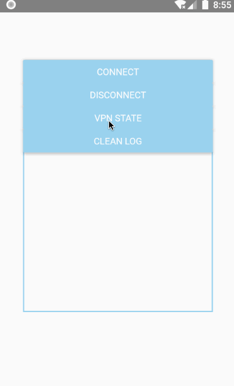
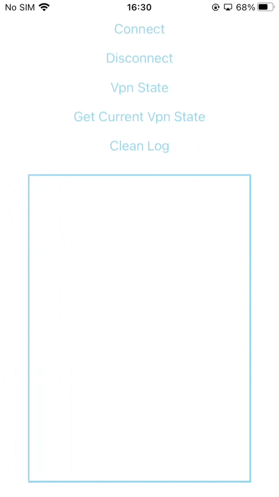
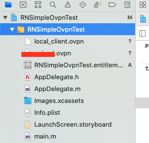

# react-native-simple-openvpn [![github stars][github-star-img]][stargazers-url]

[![npm latest][version-img]][pkg-url]
[![download month][dl-month-img]][pkg-url]
[![download total][dl-total-img]][pkg-url]
![platforms][platform-img]
[![GNU General Public License][license-img]](LICENSE)

简体中文 | [English](./README.md)

react-native-simple-openvpn 提供了与 OpenVPN 交互的接口

如果本项目对你有所帮助，请 star 🌟 鼓励，谢谢 🙏

## 版本

| RNSimpleOpenvpn | React Native |
| --------------- | ------------ |
| 1.0.0 ~ 1.2.0   | 0.56 ~ 0.66  |
| 2.0.0           | 0.63 ~ 0.68  |

## 预览

<p>
  
  
</p>

## 安装

### 添加依赖

```sh
# npm
npm install --save react-native-simple-openvpn

# or use yarn
yarn add react-native-simple-openvpn
```

### Link

从 react-native 0.60 开始，autolinking 将负责链接的步骤

```sh
react-native link react-native-simple-openvpn
```

### Android

在项目的 `android/settings.gradle` 中添加以下代码：

```diff
rootProject.name = 'example'
+ include ':vpnLib'
+ project(':vpnLib').projectDir = new File(rootProject.projectDir, '../node_modules/react-native-simple-openvpn/vpnLib')
apply from: file("../node_modules/@react-native-community/cli-platform-android/native_modules.gradle"); applyNativeModulesSettingsGradle(settings)
include ':app'
```

#### 导入 jniLibs

由于存在文件大小的限制，jniLibs 无法随模块一起发布到 npm 上。故使用 [GitHub Releases](https://github.com/ccnnde/react-native-simple-openvpn/releases) 中的 assets 来代替

下载并解压你需要的相应架构的资源，然后将其放入 `android/app/src/main/jniLibs` 中（如果 `jniLibs` 文件夹不存在则手动新建一个）

```sh
project
├── android
│   ├── app
│   │   └── src
│   │       └── main
│   │           └── jniLibs
│   │               ├── arm64-v8a
│   │               ├── armeabi-v7a
│   │               ├── x86
│   │               └── x86_64
│   └── ...
├── ios
└── ...
```

### iOS

如果使用 CocoaPods, 在 `ios/` 目录下运行

```sh
pod install
```

iOS 端 Network Extension 配置以及 OpenVPN 的集成请参阅 [iOS 指南](docs/iOS-Guide.zh-CN.md)

#### 后台退出 App 时关闭 VPN 连接

在项目的 `AppDelegate.m` 中添加以下代码：

```diff
+ #import "RNSimpleOpenvpn.h"

@implementation AppDelegate

// ...

+ - (void)applicationWillTerminate:(UIApplication *)application
+ {
+   [RNSimpleOpenvpn dispose];
+ }

@end
```

请确保 Build Settings 的 Header Search Paths 包含以下路径：

```txt
$(SRCROOT)/../node_modules/react-native-simple-openvpn/ios
```

或者, 如果你使用 CocoaPods 的话，Header Search Paths 应该会自动包含以下路径：

```txt
"${PODS_ROOT}/Headers/Public/react-native-simple-openvpn"
```

## 示例

[项目示例](./example/README.md)

## 用法

```jsx
import React, { useEffect } from 'react';
import { Platform } from 'react-native';
import RNSimpleOpenvpn, { addVpnStateListener, removeVpnStateListener } from 'react-native-simple-openvpn';

const isIPhone = Platform.OS === 'ios';

const App = () => {
  useEffect(() => {
    async function observeVpn() {
      if (isIPhone) {
        await RNSimpleOpenvpn.observeState();
      }

      addVpnStateListener((e) => {
        // ...
      });
    }

    observeVpn();

    return async () => {
      if (isIPhone) {
        await RNSimpleOpenvpn.stopObserveState();
      }

      removeVpnStateListener();
    };
  });

  async function startOvpn() {
    try {
      await RNSimpleOpenvpn.connect({
        remoteAddress: '192.168.1.1 3000',
        ovpnFileName: 'client',
        assetsPath: 'ovpn/',
        providerBundleIdentifier: 'com.example.RNSimpleOvpnTest.NEOpenVPN',
        localizedDescription: 'RNSimpleOvpn',
      });
    } catch (error) {
      // ...
    }
  }

  async function stopOvpn() {
    try {
      await RNSimpleOpenvpn.disconnect();
    } catch (error) {
      // ...
    }
  }

  function printVpnState() {
    console.log(JSON.stringify(RNSimpleOpenvpn.VpnState, undefined, 2));
  }

  // ...
};

export default App;
```

## 方法

| 名称                   | iOS | Android | 参数                                                     | 返回值  | 描述                      |
| ---------------------- | --- | ------- | -------------------------------------------------------- | ------- | ------------------------- |
| connect                | ✅  | ✅      | options: [VpnOptions](#vpnoptions)                       | promise | 连接 OpenVPN              |
| disconnect             | ✅  | ✅      | 无                                                       | promise | 关闭 OpenVPN 连接         |
| observeState           | ✅  | ❌      | 无                                                       | promise | 监听 VPN 状态             |
| stopObserveState       | ✅  | ❌      | 无                                                       | promise | 停止监听 VPN 状态         |
| addVpnStateListener    | ✅  | ✅      | callback: (e: [VpnEventParams](#vpneventparams)) => void | void    | 添加 VPN 状态变更事件监听 |
| removeVpnStateListener | ✅  | ✅      | 无                                                       | void    | 移除 VPN 状态变更事件监听 |

## 属性

| 名称       | 值                                                                                                                                                        | 描述                               |
| ---------- | --------------------------------------------------------------------------------------------------------------------------------------------------------- | ---------------------------------- |
| VpnState   | VPN_STATE_DISCONNECTED = 0 <br/> VPN_STATE_CONNECTING = 1 <br/> VPN_STATE_CONNECTED = 2 <br/> VPN_STATE_DISCONNECTING = 3 <br/> VPN_OTHER_STATE = 4 <br/> | VPN 当前状态                       |
| CompatMode | MODERN_DEFAULTS = 0 <br/> OVPN_TWO_FIVE_PEER = 1 <br/> OVPN_TWO_FOUR_PEER = 2 <br/> OVPN_TWO_THREE_PEER = 3 <br>                                          | OpenVPN 兼容模式(**Android only**) |

## 类型

### VpnOptions

```ts
interface VpnOptions {
  remoteAddress?: string;
  ovpnString?: string;
  ovpnFileName?: string;
  assetsPath?: string;
  notificationTitle?: string;
  compatMode?: RNSimpleOpenvpn.CompatMode;
  useLegacyProvider?: boolean;
  providerBundleIdentifier: string;
  localizedDescription?: string;
}
```

#### remoteAddress

VPN 服务端地址，格式为 `<ip> <port>`，未传入时使用 `xxx.ovpn` 配置文件中的地址

#### ovpnString

OpenVPN 配置文件内容的字符串形式，未传入时或传递空字符串 `''`，模块将寻找 `xxx.ovpn` 配置文件

字符串格式参考 [example.ovpn](example/android/app/src/main/assets/Japan.ovpn)

#### ovpnFileName

OpenVPN 配置文件的名称，不含扩展名，未传入时使用默认名称 `client`

#### assetsPath

**Android 专用**，OpenVPN 配置文件在 `android/app/src/main/assets/` 下的路径

- 未传入时 `assetsPath` 为 `''`，文件路径为 `assets/xxx.ovpn`
- 传入路径时，比如 `'ovpn/'`，文件路径为 `assets/ovpn/xxx.ovpn`

#### notificationTitle

**Android 专用**，通知的标题，未传入时使用默认值 `OpenVPN`

#### compatMode

**Android 专用**，[OpenVPN 兼容模式](#properties)，未传入时使用默认值 `MODERN_DEFAULTS`

| 模式                | 描述                          |
| ------------------- | ----------------------------- |
| MODERN_DEFAULTS     | Modern defaults               |
| OVPN_TWO_FIVE_PEER  | OpenVPN 2.5.x peers           |
| OVPN_TWO_FOUR_PEER  | OpenVPN 2.4.x peers           |
| OVPN_TWO_THREE_PEER | OpenVPN 2.3.x and older peers |

#### useLegacyProvider

**Android 专用**，是否加载 OpenSSL legacy provider，未传入时使用默认值 `false`

#### providerBundleIdentifier

**iOS 专用**，Network Extension target 的 bundle identifier

#### localizedDescription

**iOS 专用**，应用在设置 -> VPN 中的本地化描述名称，未传入时使用默认名称 `RNSimpleOpenvpn`

### VpnEventParams

```ts
interface VpnEventParams {
  state: RNSimpleOpenvpn.VpnState; // VPN 状态
  message: string; // VPN 状态相关的消息
  level?: string; // Android OpenVPN 库提供的连接状态描述
}
```

## 注意

### `xxx.ovpn` 配置文件

如果你不使用 [ovpnString](#ovpnstring)，不要忘记将配置文件添加你的项目中

- Android 路径 `android/app/src/main/assets/`，没有 `assets` 文件夹就新建一个
- iOS 路径为 main bundle，将文件拖拽到工程下即可

  

文件中 `remote` 所在行的格式必须如下形式

```text
...
remote <IP address> <port>
...
```

如果你不需要动态修改配置文件中的 `remote` 地址，则 Android 和 iOS 使用相同的配置文件，`options` 的 `remoteAddress` 可不传

但是，如果你需要动态修改配置文件中的 `remote` 地址，则 iOS 端配置文件需要注释掉 `remote` 所在行（如下），且始终传递 `options` 的 `remoteAddress`

```text
...
;remote <IP address> <port>>
...
```

## OpenVPN library

本项目使用到了以下项目

- Android - [ics-openvpn](https://github.com/schwabe/ics-openvpn) v0.7.33
- iOS - [OpenVPNAdapter](https://github.com/ss-abramchuk/OpenVPNAdapter) v0.8.0

## License

[GPLv2](LICENSE) © Nor Cod

<!-- badge url -->

[pkg-url]: https://www.npmjs.com/package/react-native-simple-openvpn
[stargazers-url]: https://github.com/ccnnde/react-native-simple-openvpn/stargazers
[github-star-img]: https://img.shields.io/github/stars/ccnnde/react-native-simple-openvpn?label=Star%20Project&style=social
[version-img]: https://img.shields.io/npm/v/react-native-simple-openvpn?color=deepgreen&style=flat-square
[dl-month-img]: https://img.shields.io/npm/dm/react-native-simple-openvpn?style=flat-square
[dl-total-img]: https://img.shields.io/npm/dt/react-native-simple-openvpn?label=total&style=flat-square
[platform-img]: https://img.shields.io/badge/platforms-android%20|%20ios-lightgrey?style=flat-square
[license-img]: https://img.shields.io/badge/license-GPL%20v2-orange?style=flat-square
