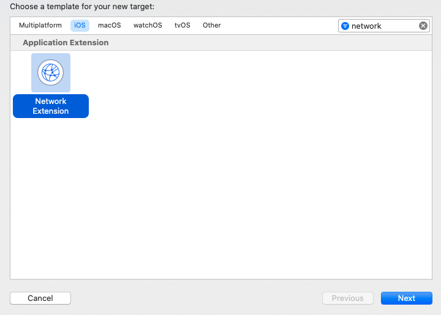
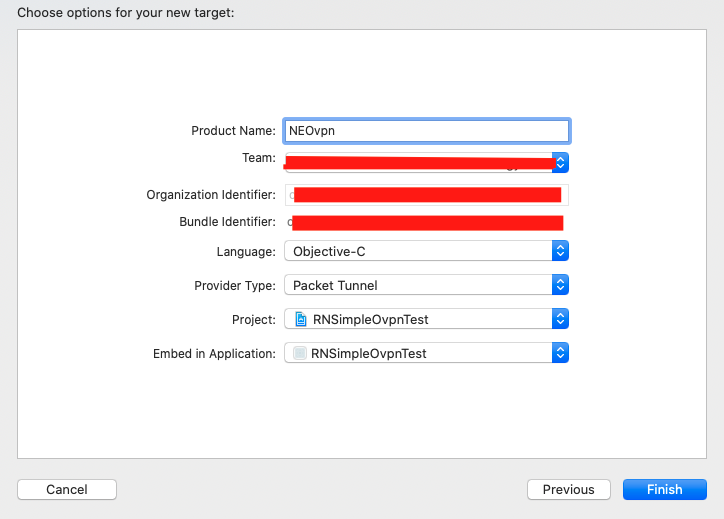
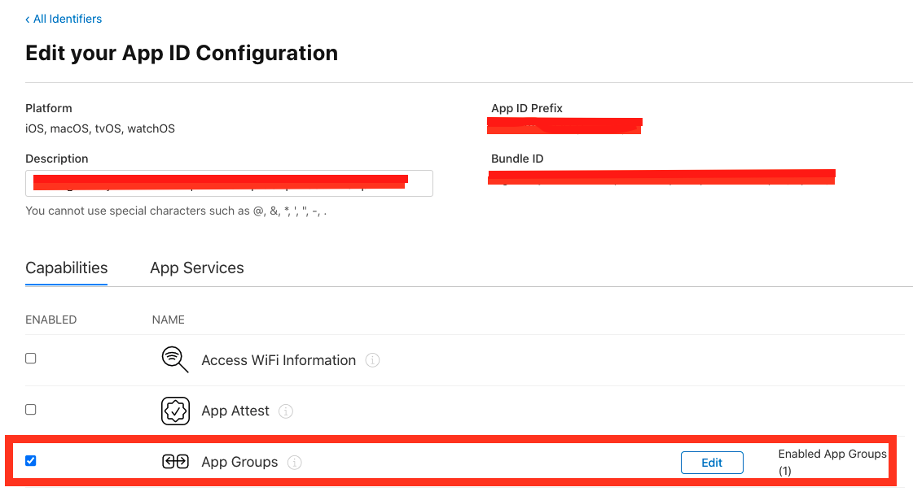
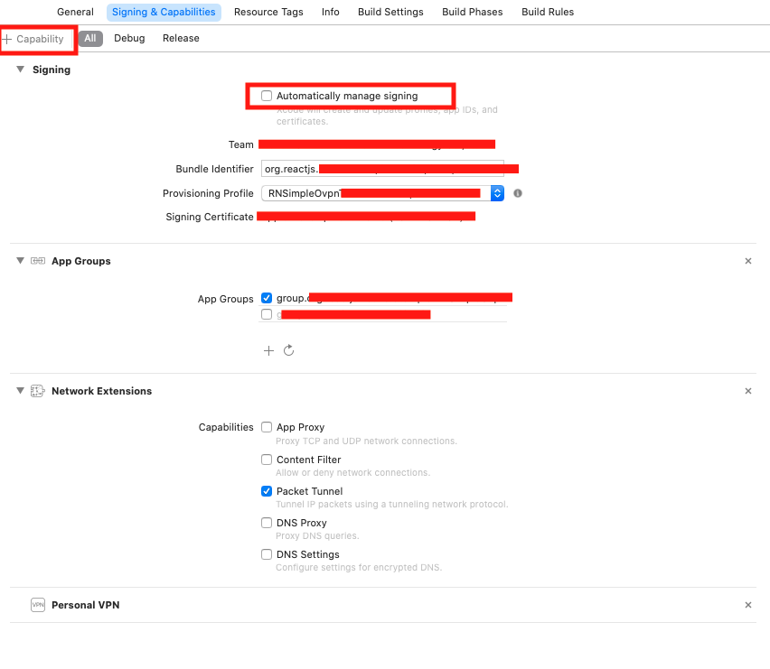
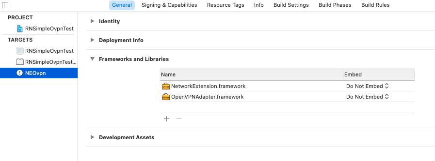
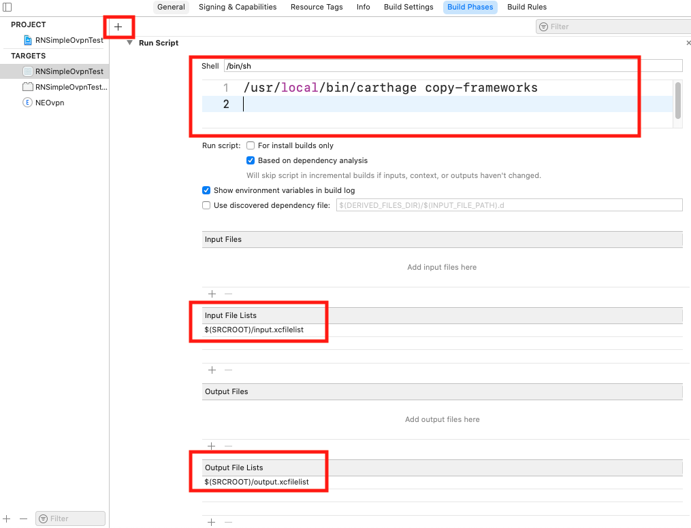
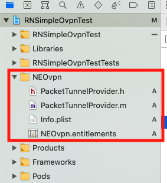
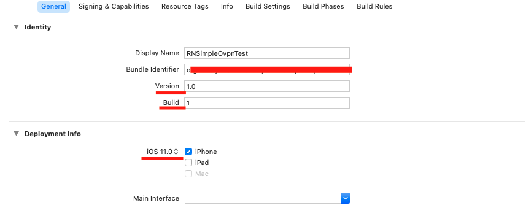

# iOS 指南

简体中文 | [English](./iOS-Guide.md)

## Network Extension

### 步骤 1

使用 Xcode 打开 iOS 端项目，创建 `Network Extension`：File -> New -> Target -> 选择后点击 Next

输入 `Network Extension` 的名称（比如 NEOvpn），其他配置参考下图（注意 Team 需和容器 App 一致）

### 步骤 2

打开 [Apple Developer](https://developer.apple.com/account/resources) 网站

> 可能在你添加 `Network Extension` 时已经自动创建了 `group` 和 `identifier`

- 创建 `group`：Identifiers -> App Groups -> 点击 `+` 添加
- Network Extension App
  - 创建 `identifier`
    - Identifiers -> App IDs -> 点击 `+` 添加
    - 输入 `Network Extension` 的 bundle identifier
    - 添加以下 `Capabilities`
      - App Groups, 选择先前创建的 `group`
      - Network Extensions
      - Personal VPN
  - 创建 `profile`
    - Profiles -> 点击 `+` 添加
    - 选择 iOS App Development/Ad Hoc/App Store
    - 选择 `Network Extension` 的 App ID
    - 生成后下载并双击安装
- 容器 App
  - 编辑你的容器 App identifier, 添加以下 `Capabilities`
    - App Groups, 选择先前创建的 `group`（和 `Network Extension` 一致）
    - Network Extensions
    - Personal VPN
  - 重新创建容器 App 的 `profile` 并安装

### 步骤 3

重新打开 Xcode，选择 `Signing & Capabilities` 标签

- Network Extension App
  - 取消勾选 `Automatically manage signing`，并选择相应的 `profile`
  - 点击左上角的 `+ Capability` 添加 以下 `Capabilities`
    - App Groups, 勾选先前创建的 `group`
    - Network Extensions, 勾选 `Packet Tunnel`
    - Personal VPN
- 容器 App 添加与 `Network Extension` 相同的 `Capabilities`

## OpenVPNAdapter

### 安装

- 运行 `brew install carthage` 获取 [Carthage](https://github.com/Carthage/Carthage)
- 在 `ios/` 目录下创建 `Cartfile` 文件，添加 `github "ss-abramchuk/OpenVPNAdapter"`，并运行 `carthage update`
- 将 `ios/Carthage/Build/iOS` 目录下的 `OpenVPNAdapter.framework` 拖拽到 Network Extension target 的 `Frameworks and Libraries`，并选择 `Do Not Embed`

  

- 选择容器 App target 的 `Build Phases` 标签

  - 点击 `+` 选择 `New Run Script Phase`，添加 `/usr/local/bin/carthage copy-frameworks`
  - 在 `ios/` 目录下创建 `input.xcfilelist` 和 `output.xcfilelist` 文件
  - 在 `Run Script Phase` 的 `Input File Lists` 添加 `input.xcfilelist`
  - 在 `Run Script Phase` 的 `Output File Lists` 添加 `output.xcfilelist`

  

`Cartfile/input.xcfilelist/output.xcfilelist` 文件内容参考本项目 `apple/` 目录下的文件

其他安装方法请参考 [OpenVPNAdapter installation](https://github.com/ss-abramchuk/OpenVPNAdapter#installation)

### PacketTunnelProvider

创建 `Network Extension` 时项目会同时创建相应的文件

将本项目 `apple/` 目录下 `PacketTunnelProvider.h/m` 文件的内容拷贝到 `Network Extension` 对应的文件

## 注意

- 如果你想使用 `Swift` 版本的 `Network Extension`，请参考 [OpenVPNAdapter usage](https://github.com/ss-abramchuk/OpenVPNAdapter#usage)
- 容器 App 的`version` 和 `build` 应该与 `Network Extension` 的保持一致, 否则在应用上传至 App Store 时会产生警告
- `Network Extension` 的 `Deployment info` 的 `iOS version` 需设置合适的值，否则设备可能无法正常开启 VPN

